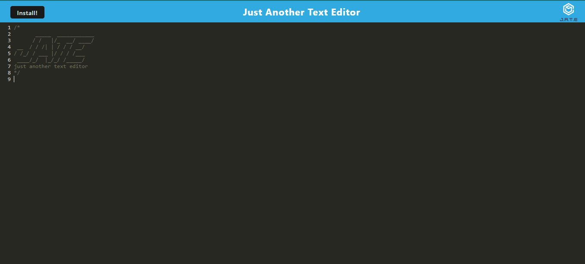

# Effective Text Editor Application

## Description

The J.A.T.E (Just Another Text Editor) is a Progressive Web Application (PWA). It creates notes or code snippets with or without an internet connection so that you can reliably retrieve them for later use!

## Table of Contents

- [Installation](#installation)
- [Usage](#usage)
- [Screenshots](#Screenshots)
- [License](#license)

## Installation

To install and test this app visit: **[link to J.A.T.E](https://warm-sea-11467-3ecf664895de.herokuapp.com/)**

## Usage

clone the starter code from this repository **git clone: https://github.com/Firene11/Effective-Text-Editor-Application.git**

When you open the application in your editor, you see a client server folder structure.

From the command line root directory run:

**npm run start** to start up the backend and serve the client.

1. When you run the text editor application from the terminal, the JavaScript files have been bundled using webpack.

2. When you run the webpack plugins, you have a generated HTML file, service worker, and a manifest file.

3. When you use next-gen JavaScript in the application, the text editor still functions in the browser without errors.

4. When you open the text editor, IndexedDB has immediately created a database storage.

5. When you enter content and click off of the DOM window, the content in the text editor is saved and when you reopen it after closing it, the content has been retrieved from our IndexedDB.

6. When you click on the Install button you can download the web application as an icon on your desktop.

7. When you load the web application, you have a registered service worker using workbox.

8. When you register a service worker, you have static assets pre cached upon loading along with subsequent pages and static assets.

## Screenshots

## License

n/a
